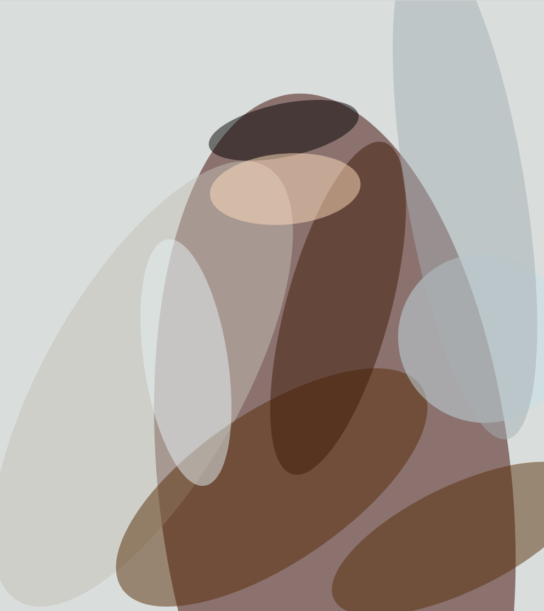
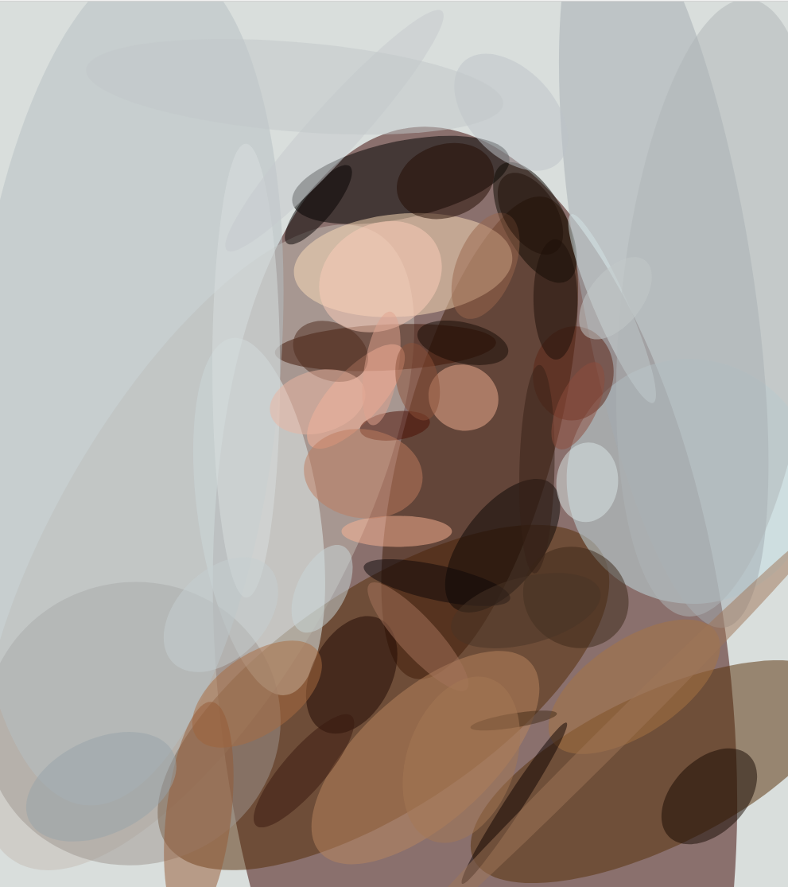

```
Turing, Approximately
Jeremy Kun
Translucent ellipses on giclée
2017
```

## Individual panels







## Print your own

Decompress [print-quality.tar.gz](print-quality.tar.gz), which contains large
.tif files that are fit for printing. Export these files to jpeg at 300 pixels
per inch (RGB color scheme), so that they came out to roughly 14in by 16in,
with a 1in margin on each side. These can be printed on giclée and stretched on
a wood frame for a final size of 12in by 14in, with some of the art spilling
onto the sides of the frame.

The jpeg/300ppi instructions were specific to my local giclée printer, so if 
yours provides different instructions you should follow those.

## Credit

The original photograph is a black and white photograph of Alan Turing,
colorized by Mads Madsen (reddit user
[/u/zuzahin](https://www.reddit.com/u/zuzahin)).


I stylized the photograph using a tool called [Primitive](https://github.com/fogleman/primitive) 
by [Michael Fogleman](https://www.michaelfogleman.com/) to output svg files
(see the `svg/` directory, [coming soon, gotta clean them up]) which can then
be scaled as large as desired.
